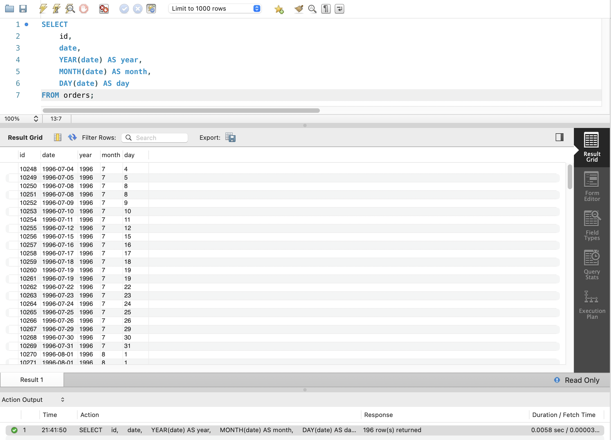
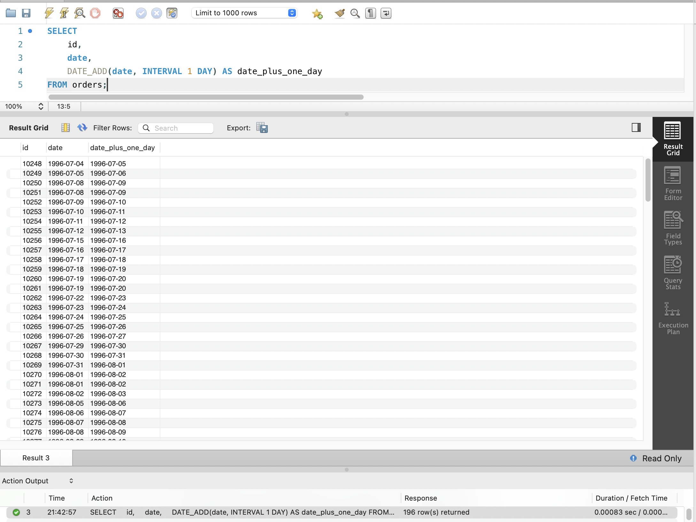
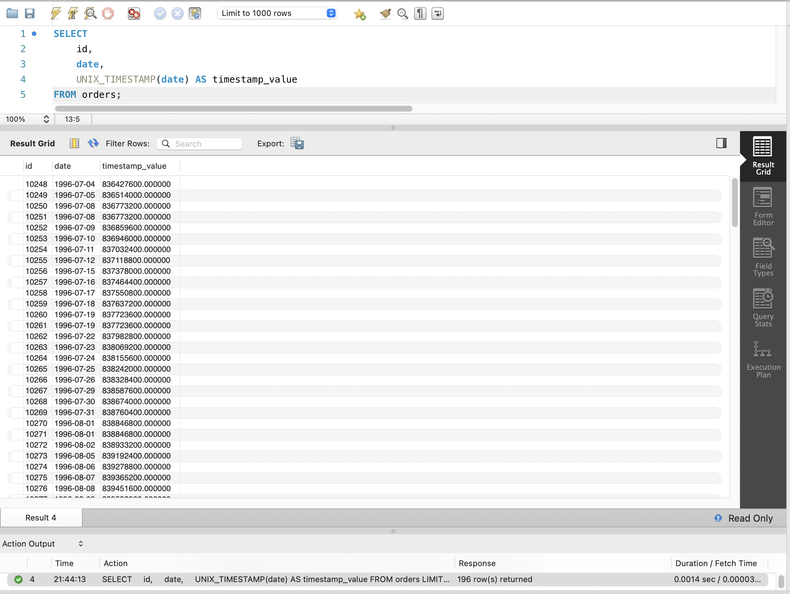
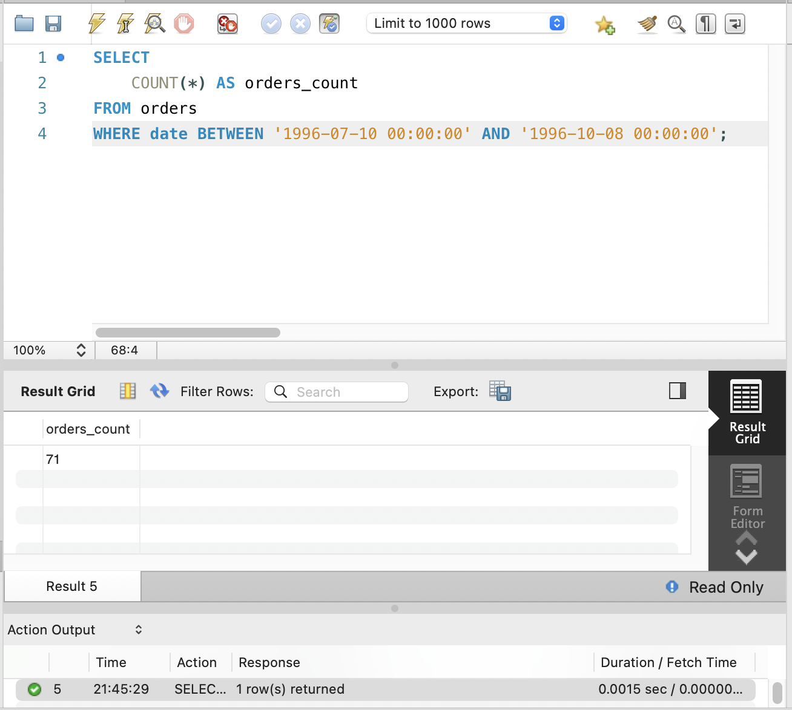
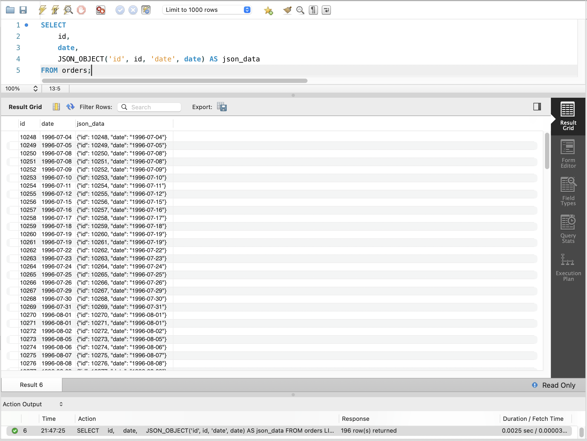

# GoIT RDB Homework 07

Цей репозиторій містить результати виконання домашнього завдання №7 з курсу Реляційних Баз Даних (GoIT).

## Завдання 1

Напишіть SQL-запит, який для таблиці `orders` з атрибута `date` витягує рік, місяць і число. Виведіть на екран їх у три окремі атрибути поряд з атрибутом `id` та оригінальним атрибутом `date` (всього вийде 5 атрибутів).

```sql
SELECT
    id,
    date,
    YEAR(date) AS year,
    MONTH(date) AS month,
    DAY(date) AS day
FROM orders;
```

**Скріншот результату:**


## Завдання 2

Напишіть SQL-запит, який для таблиці `orders` до атрибута `date` додає один день. На екран виведіть атрибут `id`, оригінальний атрибут `date` та результат додавання.

```sql
SELECT
    id,
    date,
    DATE_ADD(date, INTERVAL 1 DAY) AS date_plus_one_day
FROM orders;
```

**Скріншот результату:**


## Завдання 3

Напишіть SQL-запит, який для таблиці `orders` для атрибута `date` відображає кількість секунд з початку відліку (показує його значення timestamp). На екран виведіть атрибут `id`, оригінальний атрибут `date` та результат роботи функції.

```sql
SELECT
    id,
    date,
    UNIX_TIMESTAMP(date) AS timestamp_value
FROM orders;
```

**Скріншот результату:**


## Завдання 4

Напишіть SQL-запит, який рахує, скільки таблиця `orders` містить рядків з атрибутом `date` у межах між 1996-07-10 00:00:00 та 1996-10-08 00:00:00.

```sql
SELECT
    COUNT(*) AS orders_count
FROM orders
WHERE date BETWEEN '1996-07-10 00:00:00' AND '1996-10-08 00:00:00';
```

**Скріншот результату:**


## Завдання 5

Напишіть SQL-запит, який для таблиці `orders` виводить на екран атрибут `id`, атрибут `date` та JSON-об’єкт `{"id": <атрибут id рядка>, "date": <атрибут date рядка>}`.

```sql
SELECT
    id,
    date,
    JSON_OBJECT('id', id, 'date', date) AS json_data
FROM orders;
```

**Скріншот результату:**

